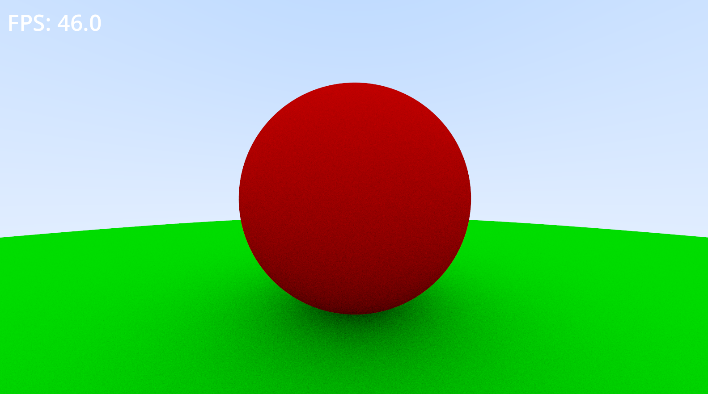

# godot-ray-tracer
A ray tracer using compute shaders in Godot, following the Ray Tracing in a
Weekend book. This project implements a custom rendering pipeline using the
Godot game engine to leverage the power of the GPU for realistically simulating
light reflecting and refracting off of objects.

## Sample

